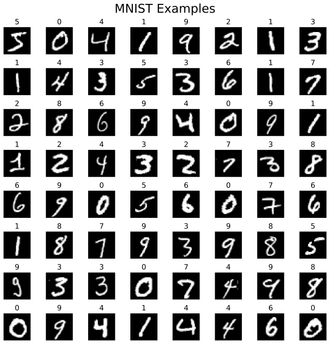
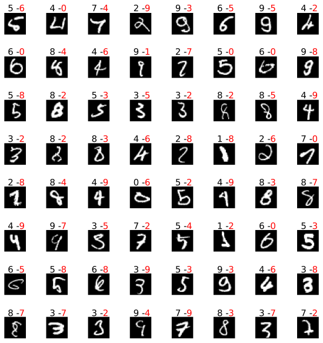
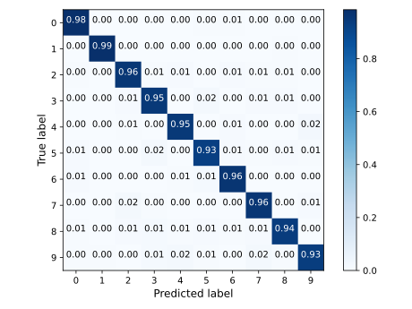
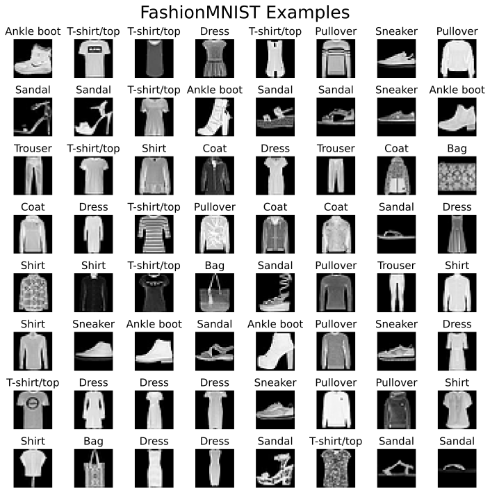
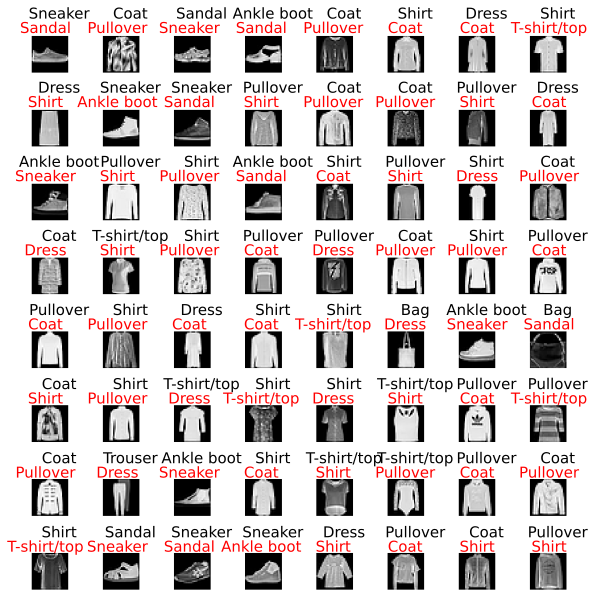
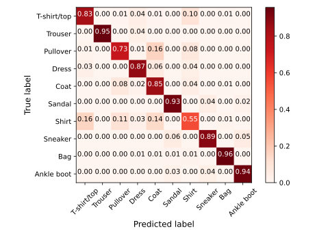

# Pytorch - MNIST - FashionMNIST

## Task 1

### MNIST module

**Show MNIST**

**Description**: Plot examples of MNIST

```bash
python3 -m Task1.show_MNIST --dataset-root <path-to-MNIST> --download <store-true>  --imgs-dir <directory-to-save-images>

# here
python3 -m Task1.show_MNIST
```



**Training**

```bash
python3 -m Task1.MNIST_train --download <store-true> --valid-split <split-ratio-of-training-dataset> --batch-size <batch-size> --test-batch-size <test-batch-size> --epochs <epochs> --init-lr <initial-learning-rate> 
-ckpt-dir <checkpoints-directort-to-save-model> --imgs-dir <directory-to-save-checkpoints> --logs-dir <directory-to-save-images> --dataset-root <root-to-dataset> --width <width-of-hidden-layers> --num-hiddens <number-of-hidden-layers> --act-name ["Sigmoid", "Tanh", "ReLU"](defualt "Sigmoid") --reg-name ["bn", "dropout_0.25", "dropout_0.5", "None"](default "None")
```

**Analyzing**

```bash
python3 -m Task1.MNIST_analyze --imgs-dir <directory-to-save-checkpoints>  --plot-mistakes <store-true> --confusion-matrix <store-true> --ckpt-file <checkpoint-file>
```

**Plot Mistakes**



**Confusion Matrix**



### Task 1-1

**Description**: use simple fully connected network with Sigmoid as activation function on MNIST dataset

Train fully-connected network

```bash
python3 -m Task1.MNIST_train --width 1 --num-hiddens 32 --act-name Sigmoid
```
epochs = 20, learning rate = 0.001, SGD, cross entropy

Test loss: 0.140	Test accuracy: 0.958

### Task 1-2

activation function: Sigmoid

| number of hidden layers / width of hidden layers | 32    | 64    | 128   | 256   |
| :----------------------------------------------: | ----- | ----- | ----- | ----- |
|                        2                         | 0.963 | 0.969 | 0.974 | 0.976 |
|                        3                         | 0.948 | 0.963 | 0.968 | 0.974 |
|                        4                         | 0.944 | 0.952 | 0.967 | 0.975 |
|                        5                         | 0.926 | 0.955 | 0.963 | 0.976 |

Analyze trained fully-connected network, plot examples of mistakes and confusion matrix

```bash
python3 -m Task1.MNIST_train --act-name <name-of-activation-function> --width <width-of-hidden-layer> --num-hiddens <number-of-hidden-layer>
```

### Task 1-3

**Description**: Try different activation functions and regularization tricks like dropout,  batch normalization to train fully-connected neural network on MNIST

Experiment:

```bash
python3 -m Task1.MNIST_train --act-name <name-of-activation-function> --width <width-of-hidden-layer> --num-hiddens <number-of-hidden-layer> --reg-name <name-of-regularization-method>
```

**ReLU**

| num_layers / regularization | None  | Batch Normalization | dropout 0.25 | dropout 0.5 |
| --------------------------- | ----- | ------------------- | ------------ | ----------- |
| 2 (ReLU)                    | 0.977 | 0.978               | 0.980        | 0.979       |
| 3 (ReLU)                    | 0.976 | 0.981               | 0.977        | 0.977       |
| 4 (ReLU)                    | 0.974 | 0.981               | 0.979        | 0.975       |
| 5 (ReLU)                    | 0.981 | 0.983               | 0.979        | 0.975       |
| 5 (Sigmoid)                 | 0.976 | 0.975               | 0.967        | 0.955       |
| 5 (Tanh)                    | 0.971 | 0.977               | 0.975        | 0.961       |

### FashionMNIST Module

**Show FashionMNIST**



**Training**

```BASH
python3 -m Task1.FashionMNIST_train --download <store-true> --valid-split <split-ratio-of-training-dataset> --batch-size <batch-size> --test-batch-size <test-batch-size> --epochs <epochs> --init-lr <initial-learning-rate> 
-ckpt-dir <checkpoints-directort-to-save-model> --imgs-dir <directory-to-save-checkpoints> --logs-dir <directory-to-save-images> --dataset-root <root-to-dataset> --width <width-of-hidden-layers> --num-hiddens <number-of-hidden-layers> --act-name ["Sigmoid", "Tanh", "ReLU"](defualt "Sigmoid") --reg-name ["bn", "dropout_0.25", "dropout_0.5", "None"](default "None")
```

**Analyzing**

```bash
python3 -m Task1.FashionMNIST_analyze --imgs-dir <directory-to-save-checkpoints>  --plot-mistakes <store-true> --confusion-matrix <store-true> --ckpt-file <checkpoint-file>
```

**Plot Mistakes**

[Note] Need to tune coefficients in `plot_mistakes()` in `./tools/plot.py` to arrange layout of annotations.



**Confusion Matrix**



### Task 1-4

**Description**: Repeat above tasks on Fashion-MNIST

```bash
python3 -m Task1.FashionMNIST_train --width <width-of-hidden-layers> --num-hiddens <number-of-hidden-layers> --act-name ["Sigmoid", "Tanh", "ReLU"](defualt "Sigmoid") --reg-name ["bn", "dropout_0.25", "dropout_0.5", "None"](default "None")
```

No regularization, explore the relationship between width of hidden layers, number of hidden layers of fully-connected neural network with ReLU as activation function and accuracy on test dataset. 

| number of hidden layers / width of hidden layers | 32 (None / bn) | 64             | 128           | 256           |
| :----------------------------------------------: | -------------- | -------------- | ------------- | ------------- |
|                        1                         | 0.874 / 0.874  | 0.870 / 0.880  | 0.880 / 0.884 | 0.885 / 0.884 |
|                        2                         | 0.866 / 0.877  | 0.872 / 0.883  | 0.876 / 0.885 | 0.884 / 0.889 |
|                        3                         | 0.864 / 0.875  | 0.879  / 0.886 | 0.880 / 0.888 | 0.886 / 0.890 |
|                        4                         | 0.873 / 0.870  | 0.880 / 0.877  | 0.879 / 0.888 | 0.889 / 0.891 |
|                        5                         | 0.870 / 0.868  | 0.877 / 0.878  | 0.878 / 0.888 | 0.887 / 0.890 |
|                        6                         | 0.867 / 0.875  | 0.876 / 0.881  | 0.869 / 0.887 | 0.886 / 0.891 |
|                        7                         | 0.865 / 0.876  | 0.876 / 0.878  | 0.867 / 0.889 | 0.879 / 0.894 |

7 layers, 256 hidden neurons

|              | ReLU  | Tahn  | Sigmoid |
| ------------ | ----- | ----- | ------- |
| None         | 0.879 | 0.873 | 0.098   |
| batchnorm    | 0.894 | 0.882 | 0.873   |
| dropout 0.25 | 0.877 | 0.864 | 0.098   |
| dropout 0.5  | 0.851 | 0.847 | 0.098   |

While batch normalization helps optimization and thus imprves model's testing performance, dropout could only avoid overfitting instead of helping model reach better solution. 
